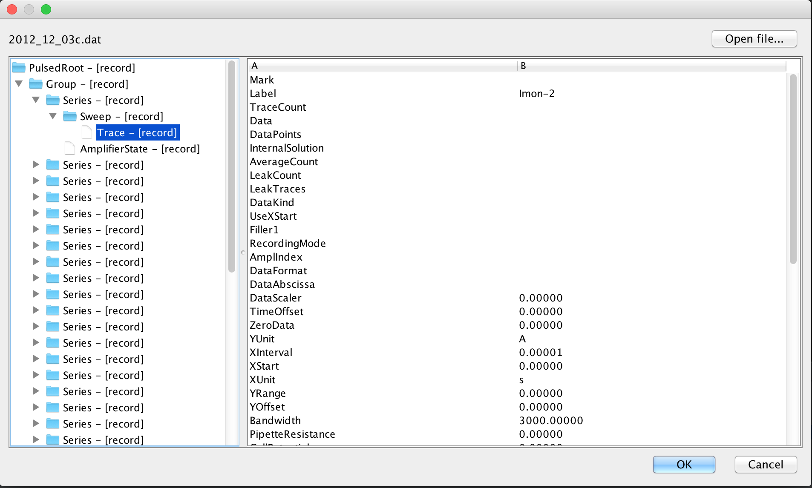

Patchmaster & Java
==================

The purpose of this little tool is to read HEKA patchmaster
files from the Java programming language.

Dynamic Tree Building
---------------------

One interesting aspect of this library is that creates the meta
information about the structure of the file format directly from 
the specification provided by HEKA (see below). This information
is then used to create the data tree representing the file in 
memory.

GUI
---

A very simple GUI is provided that displays data in the file
in the tree as it is stored in the file.

File format
-----------

Information about the file format can be obtained via ftp
directly from [HEKA](ftp://server.hekahome.de/pub/FileFormat/Patchmasterv9).

